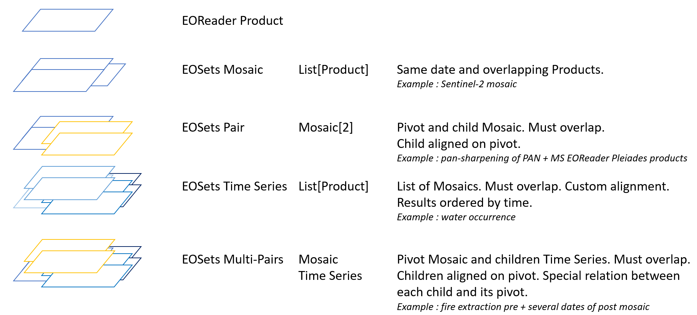

# EOSets

This library aims to simplify any process working with sets of EO data handled by [EOReader](https://github.com/sertit/eoreader).

## Content

EOSets implement these objects:

NB: multi-pairs are not really implemented for now. We are waiting for true usecases. For now please use a list of pairs to process your data.

## Features

Implemented features are similar to those implemented in EOReader:
- `load`
- `stack`
- `extent`
- `footprint`
- ...

## Examples

Available notebooks provided as examples:

- [Mosaic](https://eosets.readthedocs.io/en/latest/notebooks/mosaic.html#)
- [Pair](https://eosets.readthedocs.io/en/latest/notebooks/pair.html)
- [Series](https://eosets.readthedocs.io/en/latest/notebooks/series.html)